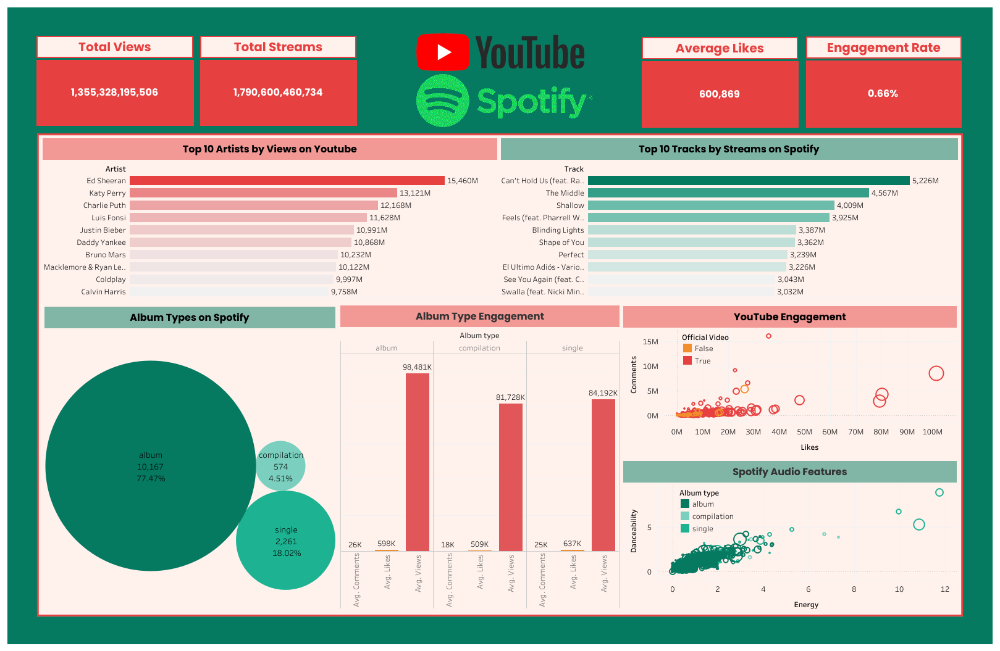

### 🎶📊 Dashboard Spotify & YouTube Analytics

Dashboard ini dibuat untuk menganalisis performa musik di dua platform digital terbesar, yaitu **Spotify** dan **YouTube**. Analisis ini bertujuan memberikan gambaran menyeluruh mengenai **tren konsumsi musik, engagement audiens, serta karakteristik lagu** yang berkontribusi pada popularitas artis maupun track tertentu.

Pada dashboard ini, data dikumpulkan dari berbagai atribut penting, seperti **views, likes, comments, streams, album type, danceability, energy, hingga status official video**. Visualisasi dirancang agar memudahkan pembaca untuk:

* Membandingkan **performa artis dan track teratas** di kedua platform.
* Melihat **pola engagement audiens** berdasarkan interaksi (likes & comments).
* Mengidentifikasi **perbedaan kontribusi album vs single** terhadap performa musik.
* Mengetahui bagaimana **fitur audio (danceability, energy, tempo)** memengaruhi popularitas lagu di Spotify.

Dengan dashboard ini, diharapkan pengguna dapat memahami **strategi musik digital** yang efektif, baik dari sisi **konten video YouTube** maupun **karakteristik audio di Spotify**, sehingga dapat menjadi dasar dalam **pengambilan keputusan bisnis di industri musik**.

---

## 🔗 Live Demo
[**View Dashboard on Tableau Public**](https://public.tableau.com/views/SpotifyandYoutubeAnalyst/Dashboard1?:language=en-US&:sid=&:redirect=auth&:display_count=n&:origin=viz_share_link)

---

### 📊 **Insight dari Dashboard**

1. **Total Engagement**

   * YouTube memiliki **lebih dari 1,3 miliar views**, sedangkan Spotify mencatat **lebih dari 1,7 miliar streams**.
   * Rata-rata likes per konten di YouTube cukup tinggi (**600 ribu likes**), tetapi **engagement rate hanya 0,66%**, menunjukkan audiens banyak menonton tapi tidak banyak yang aktif berinteraksi.

2. **Top Artists di YouTube**

   * **Ed Sheeran** menempati posisi teratas dengan **15,46M views**, diikuti oleh Katy Perry (13,12M) dan Charlie Puth (12,16M).
   * Artis global dengan fanbase besar mendominasi, terutama dari genre pop.

3. **Top Tracks di Spotify**

   * Lagu **“Can’t Hold Us”** menjadi track dengan streams tertinggi (**5,226M**), diikuti “The Middle” (4,567M) dan “Shallow” (4,009M).
   * Ini menunjukkan tren bahwa **lagu kolaborasi internasional** punya performa tinggi di Spotify.

4. **Album Types**

   * **Album** mendominasi katalog Spotify (**77,47%**) dibanding **single** (18,02%) dan **compilation** (4,51%).
   * Namun, meski album mendominasi jumlah, single masih menyumbang kontribusi signifikan dalam **engagement**.

5. **Album Type Engagement**

   * **Album** rata-rata mendapatkan **598K likes** dan **98,481K views**.
   * **Single** lebih unggul dalam **likes (637K)**, meskipun views lebih kecil.
   * Artinya, **single cenderung lebih engaging** meski distribusinya lebih sedikit.

6. **YouTube Engagement (Likes vs Comments)**

   * Banyak video resmi (**official video = True**) memiliki engagement lebih tinggi dibanding non-official.
   * Video musik dengan likes tinggi tidak selalu memiliki jumlah komentar tinggi → engagement lebih banyak berbasis **like pasif** daripada interaksi.

7. **Spotify Audio Features (Danceability vs Energy)**

   * Lagu dengan **danceability tinggi** (mudah untuk dance) cenderung juga memiliki **energy tinggi**, dan banyak dari jenis **single**.
   * Tren ini mendukung bahwa **lagu upbeat lebih populer untuk streaming**, terutama di Spotify.

---

### 💡 **Rekomendasi Bisnis**

1. **Optimalkan Engagement Rate YouTube**

   * Dorong artis untuk menambahkan **CTA (Call to Action)** seperti ajakan komen, challenge, atau live session.
   * Buat konten interaktif (misalnya behind the scenes, Q\&A) agar audiens lebih aktif.

2. **Fokus pada Single untuk Boost Engagement**

   * Meski album mendominasi, **single terbukti lebih engaging**.
   * Label bisa fokus merilis lebih banyak **single strategis** sebelum full album, untuk meningkatkan hype.

3. **Kolaborasi Strategis**

   * Lagu kolaborasi terbukti sukses di Spotify (“Can’t Hold Us”, “The Middle”).
   * Rekomendasi: perbanyak **kolaborasi lintas genre dan lintas negara** untuk memperluas pasar.

4. **Promosi Berdasarkan Audio Features**

   * Lagu dengan **energy tinggi dan danceability besar** lebih disukai di Spotify.
   * Bisa digunakan untuk campaign **playlist khusus workout, party, atau dance** yang potensial menarik audiens muda.

5. **Diversifikasi Konten YouTube**

   * Tidak hanya official video, tetapi juga **konten tambahan** seperti lyric video, live performance, dan short-form (YouTube Shorts).
   * Ini dapat menaikkan engagement lebih tinggi.

6. **Optimalkan Album Engagement**

   * Album memiliki distribusi besar tapi engagement lebih rendah dari single.
   * Solusi: buat promosi album berbasis storytelling (contoh: konsep album, teaser tiap lagu) agar fans lebih engage.

---
